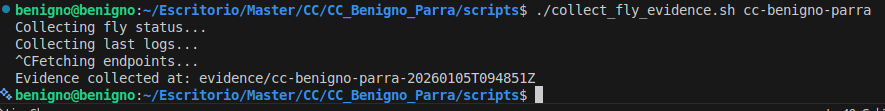
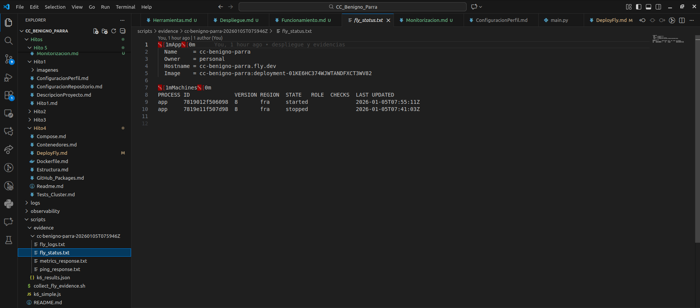
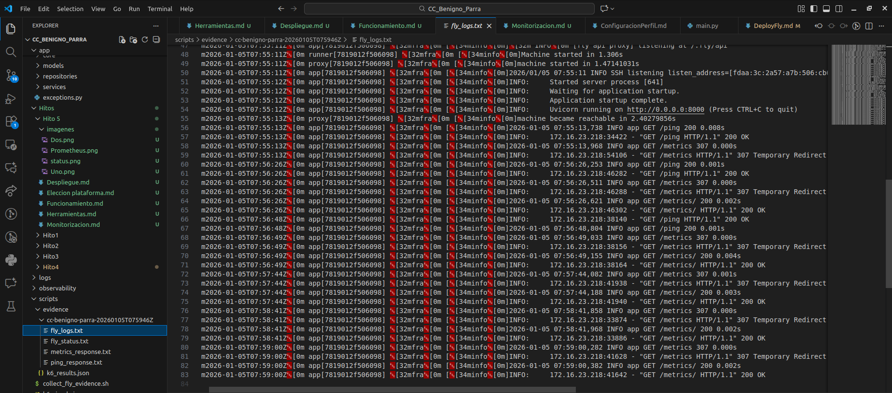
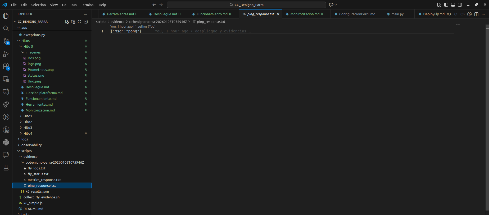
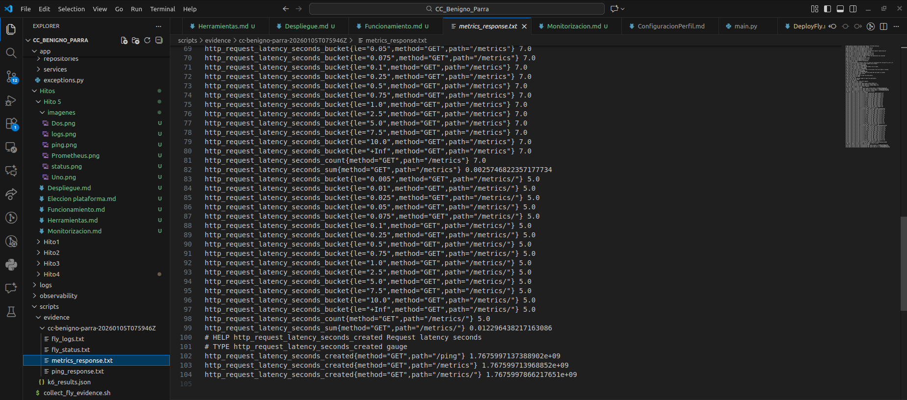

# Funcionamiento correcto del despliegue en el IaaS/PaaS

Este documento describe cómo verificar el funcionamiento correcto del despliegue en el IaaS/PaaS usando el script de comprobación provisto en el repositorio: `scripts/collect_fly_evidence.sh`.

- Uso principal: ejecutar `scripts/collect_fly_evidence.sh <FLY_APP_NAME>` para recopilar estado, logs y respuestas de endpoints en un directorio `evidence/<APP>-<TIMESTAMP>` listo para adjuntar.
- Ventaja: evita comandos dispersos; el script ya implementa las comprobaciones necesarias y guarda los archivos de evidencia.

Requisitos previos

- `flyctl` instalado y autenticado (el script usa `flyctl` para obtener `status` y `logs`).
- `curl` disponible en la máquina desde la que ejecutes el script.

Ejecutar el script

1. Desde la raíz del repositorio ejecuta:

```bash
./scripts/collect_fly_evidence.sh cc-benigno-parra
```



2. Salida esperada: el script crea un directorio `evidence/<FLY_APP_NAME>-<TIMESTAMP>/` y escribe varios archivos dentro (ver siguiente sección). El script imprime la ruta del directorio al terminar.

Archivos que genera `collect_fly_evidence.sh`

- `fly_status.txt` — salida de `flyctl status --app <APP>`.
- `fly_logs.txt` — colección de logs recientes (el script intenta `--since`, luego `--num 200`, y finalmente `logs` sin argumentos según la versión de `flyctl`).
- `ping_response.txt` — respuesta cruda del endpoint `https://${APP}.fly.dev/ping`.
- `metrics_response.txt` — primeras líneas de `https://cc-benigno-parra.fly.dev/metrics` (nota: la URL de métricas está fijada en el script; ver 'Notas' si tu aplicación usa otro hostname).

Qué comprobar en esos archivos

- `fly_status.txt`: confirma que las instancias están desplegadas y el número de réplicas.



- `fly_logs.txt`: busca `ERROR`, `Traceback` o fallos de arranque; verifica que no hay errores fatales en el arranque.




- `ping_response.txt`: debe contener `pong`.




- `metrics_response.txt`: debe contener métricas Prometheus instrumentadas.

