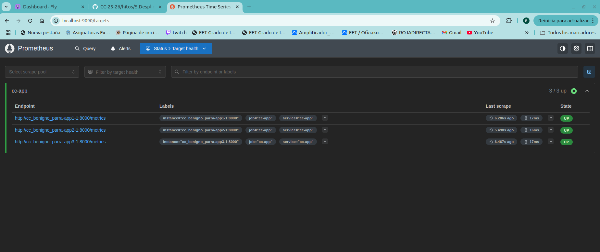
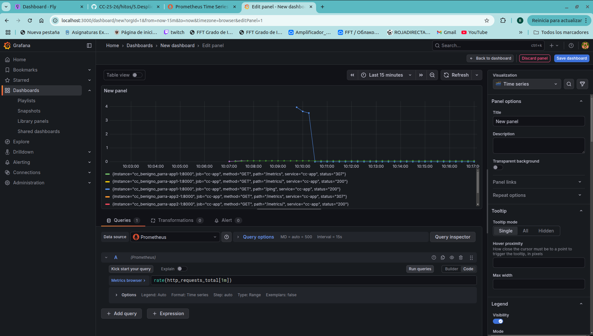
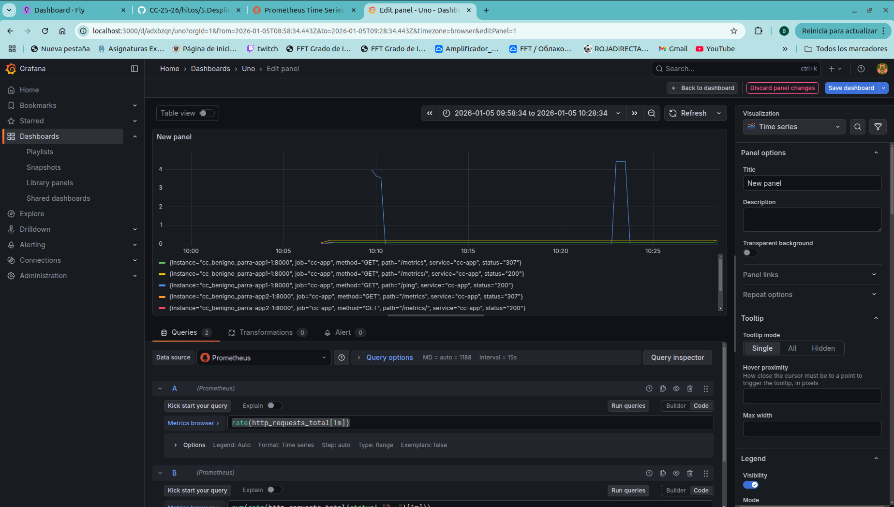

# Monitorización: descripción, justificación y configuración

En este proyecto se implementó una solución de observabilidad compuesta por métricas y paneles para supervisar la aplicación en tiempo real. Las piezas principales son:

- Instrumentación en la aplicación (métricas Prometheus / OpenTelemetry) — dentro de `app/api/main.py` y `observability/telemetry.py`.
- Prometheus: recolección de métricas mediante `prometheus_client` expuesto en `/metrics`.
- Grafana: visualización y dashboards (provisioning incluido en `observability/grafana/`).

Objetivos de la monitorización
- Obtener métricas de consumo (peticiones, latencias, errores).
- Visualizar en tiempo real con dashboards y consultas ad-hoc.
- Poder capturar evidencia (gráficas, estados, logs) para la entrega.

Componentes y justificación
- **Instrumentación en la aplicación**
  - Qué: métricas básicas (contador `http_requests_total`, histograma/summary de latencias) y middleware para etiquetar peticiones.
  - Por qué: permite contar peticiones, identificar errores y medir latencias por endpoint; es la base para todas las alertas y dashboards.
  - Dónde: `app/api/main.py` (usa `prometheus_client`); `observability/telemetry.py` contiene helpers OTLP si se requiere tracing.

- **Prometheus (local / Docker Compose)**
  - Qué: scrapper que consulta el endpoint `/metrics` de cada réplica y almacena series temporales.
  - Por qué: estándar para métricas; fácil de integrar con aplicaciones instrumentadas en Python y con Grafana.
  - Dónde está la configuración: `observability/prometheus.yml` y `observability/docker-compose.observability.yml`.

- **Grafana (local / provisionado)**
  - Qué: visualización de métricas, dashboards y paneles preconfigurados.
  - Por qué: permite crear dashboards legibles para mostrar evidencias (p95, errores, throughput) y compartir capturas.
  - Dónde: `observability/grafana/provisioning/` contiene datasources/dashboards JSON de ejemplo.

- **Grafana Agent / remote_write (opcional)**
  - Qué: agente para enviar métricas a Grafana Cloud (remote_write) o a otro backend.
  - Por qué: útil si quieres centralizar métricas en la nube o usar un plan de Grafana remoto. Requiere API key/metrics publisher y endpoint correcto.
  - Observación: en pruebas previas se obtuvo HTTP 401 si las claves no fueron correctas — asegurarse del tipo de key y endpoint exacto.

Despliegue y ejecución local (cómo levantar la monitorización)
-
1. Levantar la aplicación (si no está corriendo):
```bash
docker compose -f compose.yaml up -d --build
```
2. Levantar la pila de observabilidad local:
```bash
docker compose -f observability/docker-compose.observability.yml up -d
```
3. Verifica que Prometheus está raspando los targets (http://localhost:9090/targets).



4. Abrir Grafana (http://localhost:3000) y cargar los dashboards

Puntos de configuración relevantes (archivos en el repo)
- `app/api/main.py` — instrumentación y middleware que expone `/metrics`.
- `observability/prometheus.yml` — targets y scrape_configs.
- `observability/docker-compose.observability.yml` — Prometheus + Grafana compose para pruebas locales.
- `observability/grafana/provisioning/` — JSON de dashboards y datasource de ejemplo.
- `observability/grafana-agent.yaml` — plantilla del agente si se usa remote_write.
- `observability/telemetry.py` — helper para inicializar OTLP/trace exporter.

Consultas Prometheus
-
- gráfico de solicitudes por segundo en el rango de 15 minutos a partir de la consultaa:
  - `rate(http_requests_total[1m])`



- Tasa de errores por segundo, calculada desde métricas instrumentadas; permite correlacionar errores con picos de carga.:
  - `sum(rate(http_requests_total{status!~"2.."}[1m]))`

