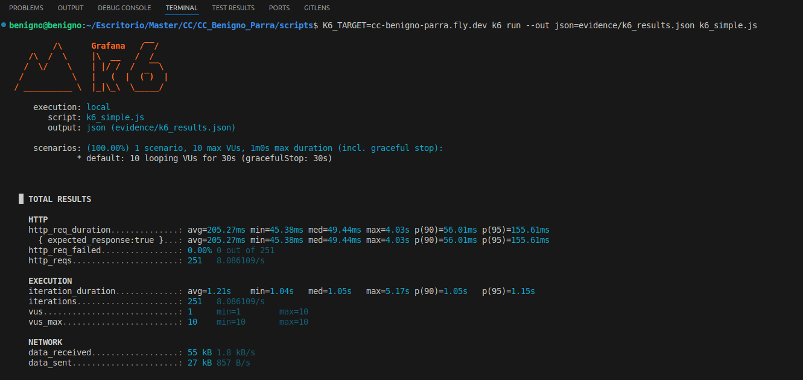

# Pruebas de prestaciones de la aplicación desplegada

Este documento explica cómo ejecutar y recoger evidencia de las pruebas de prestaciones (load test) sobre la aplicación desplegada en el PaaS usando `k6`.

Objetivo
- Ejecutar la prueba de carga contra el host desplegado `cc-benigno-parra.fly.dev` y recoger el `JSON` de salida en `scripts/evidence/k6_results.json` como evidencia.

Requisitos previos
- Tener `k6` instalado en la máquina donde ejecutes la prueba.
- Situarte en la carpeta `scripts/` del repositorio antes de ejecutar el comando.

Comando exacto (ejecutar desde `scripts/`)

```bash
K6_TARGET=cc-benigno-parra.fly.dev k6 run --out json=evidence/k6_results.json k6_simple.js
```

Notas sobre el comando
- `K6_TARGET` es la variable de entorno que usa `k6_simple.js` para construir las peticiones (por eso el script usa `https://${K6_TARGET}/ping` en su flujo).
- `--out json=...` guarda todos los eventos/resultados en formato NDJSON (una línea por evento) en `scripts/evidence/k6_results.json`.
- Ejecuta el comando desde `scripts/` para que la ruta `evidence/k6_results.json` se cree en `scripts/evidence/`.

Captura de resumen en consola:
- Para guardar también el resumen que muestra `k6` en consola.




Procesado básico y extracción de métricas, algunos comandos útiles:

- Contar entradas de fallo HTTP (si las hay):
  ```bash
  grep -c '"http_req_failed"' scripts/evidence/k6_results.json || true
  ```
- Buscar errores concretos en la salida JSON (líneas que contienen `error` o `lookup`):
  ```bash
  grep -i 'error\|lookup' -n scripts/evidence/k6_results.json || true
  ```
- Mostrar el resumen guardado (si usaste `tee`):
  ```bash
  cat scripts/evidence/k6_summary.txt
  ```