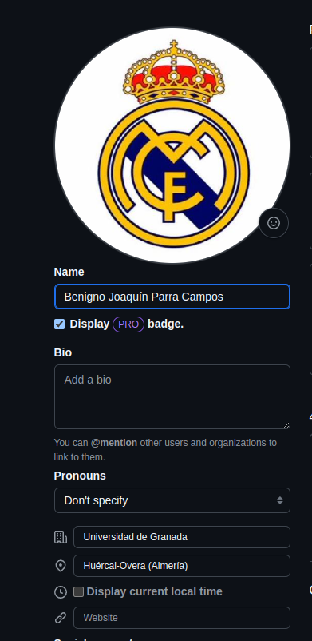
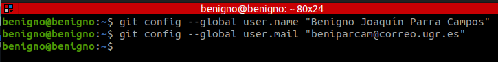
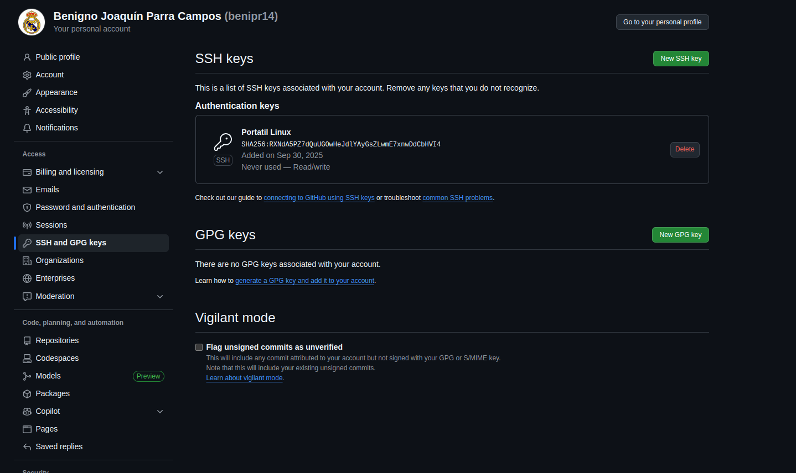
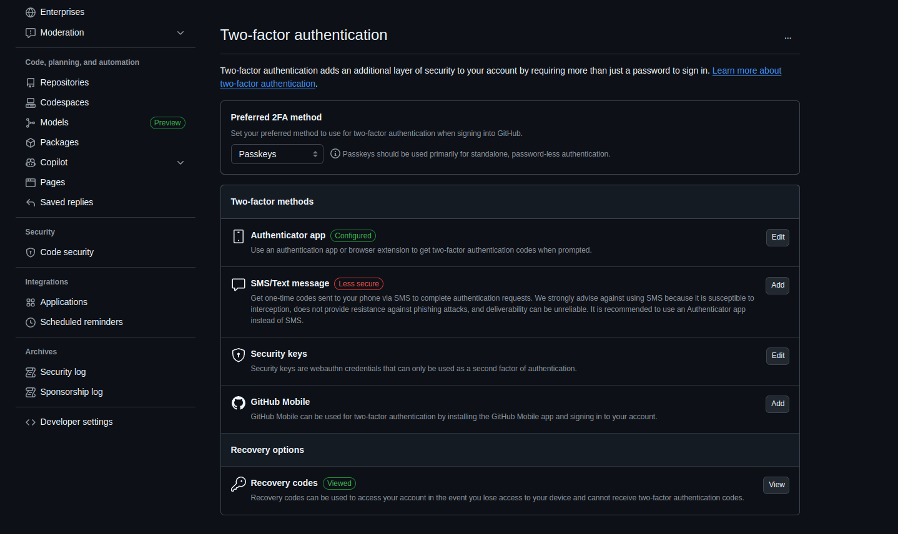

# Configuración del perfil

Desde la interfaz de GitHub, se pueden configurar los ajustes del perfil público de nuestra cuenta. Se han añadido:

* Nombre y apellidos: Benigno Joaquín Parra Campos
* Dirección de correo pública: beniparcam@correo.ugr.es
* Localidad: Huércal-Overa
* Compañía: Estudiante de la Universidad de Granada

La imagen de perfil ya se tenía con anterioridad.

Después, se ha configurado el nombre y el email de los commits con los siguientes comandos

# Creación del par de claves SSH pública/privada

Para generar un par de claves de utilizó el comando:

Esto me generó 2 archivos, uno público ~/.ssh/id_ed25519.pub y otro privado, ~/.ssh/id_ed25519 el cual no debo compartir.

Luego, copié mi clave pública y la subí al apartado correspondiente de mi github:

Por último, se activó el doble factor de autenticación mediante app:

