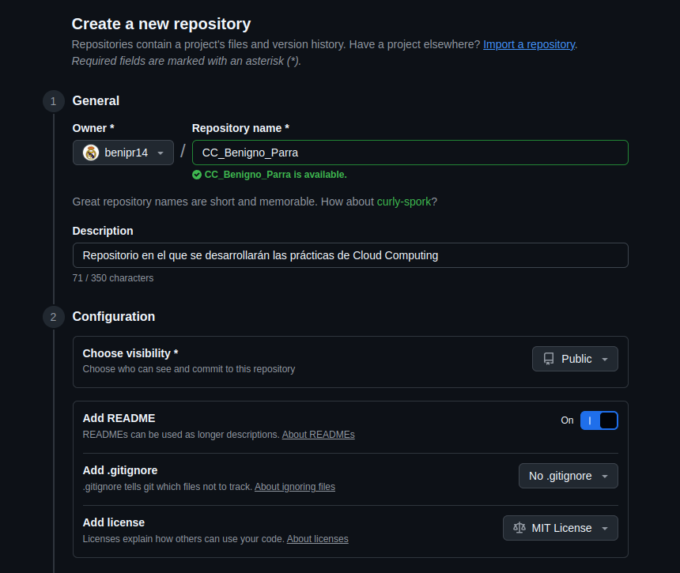
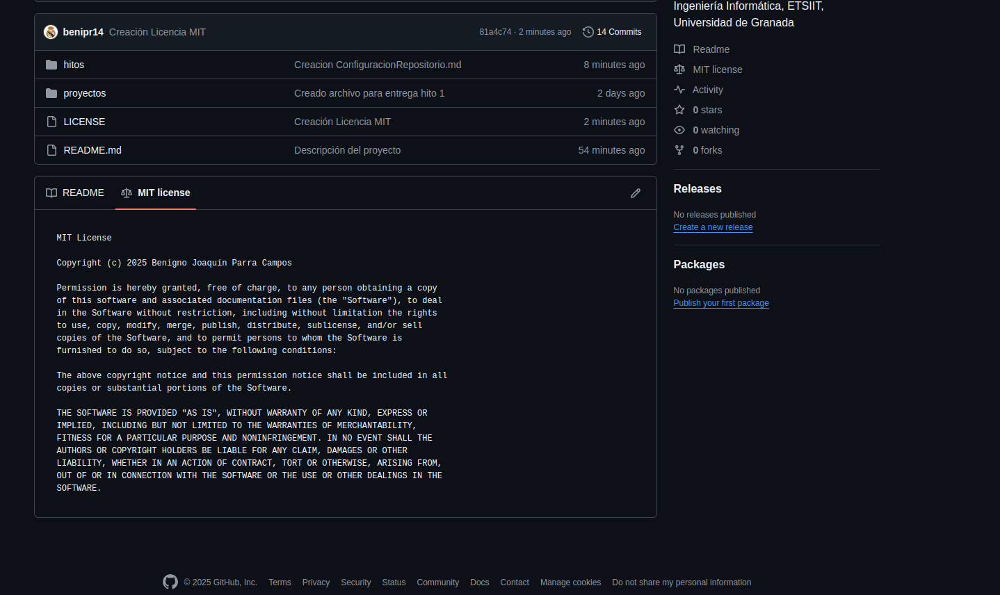
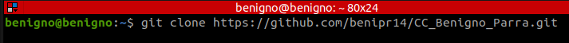

# Creación y configuración del repositorio

En este apartado se detallan los pasos seguidos para la creación y configuración del respositorio.

El primero de ellos fue clicar en 'nuevo repositorio' y rellenar los campos correspondientes:

La licencia que se eligió fue una licencia MIT:

Se ha creado también un archivo .gitignore aunque de momento se ha dejado vacío.

Por último, se ha hecho una clonación del repositorio en mi portátil para poder trabajar en local:

