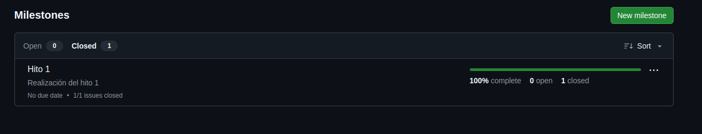
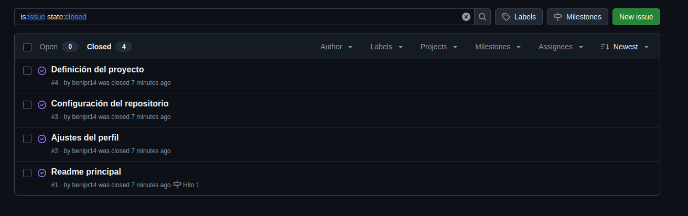

# Creación y configuración del repositorio

En este apartado se detallan los pasos seguidos para la creación y configuración del respositorio.

El primero de ellos fue clicar en 'nuevo repositorio' y rellenar los campos correspondientes:

La licencia que se eligió fue una licencia MIT:

Acto seguido, se ha hecho una clonación del repositorio en mi portátil para poder trabajar en local:

También se ha creado un archivo .gitignore aunque de momento se ha dejado vacío.

Para una mejor organización se ha hecho uso de un milestone llamado 'hito 1':

Este milestone tenía 4 issues que son:

