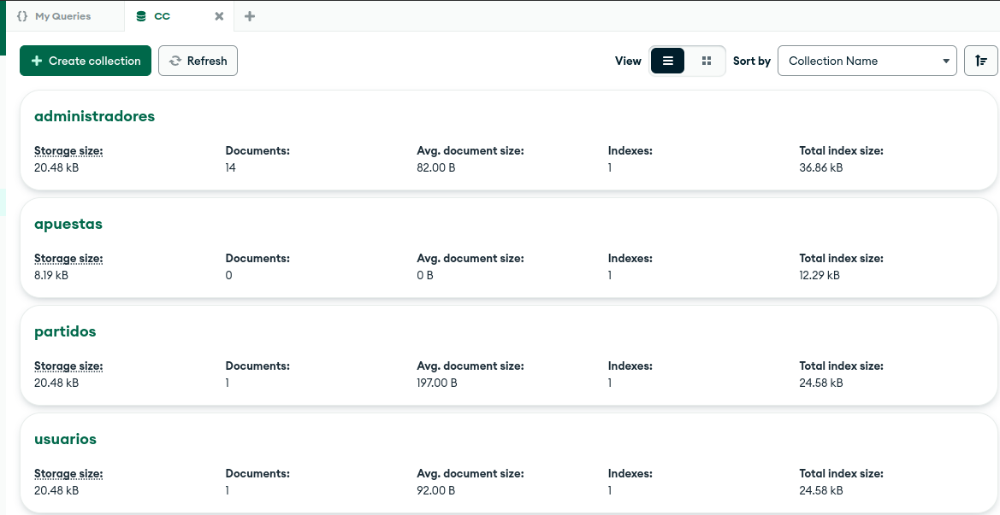
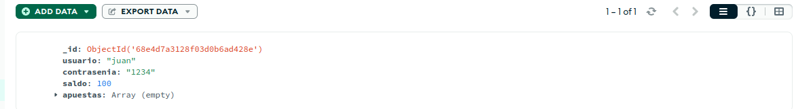
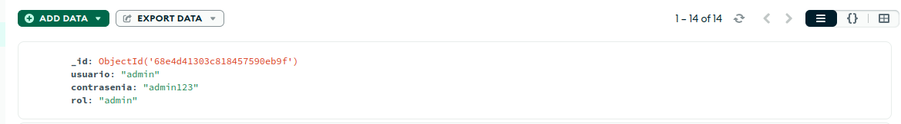
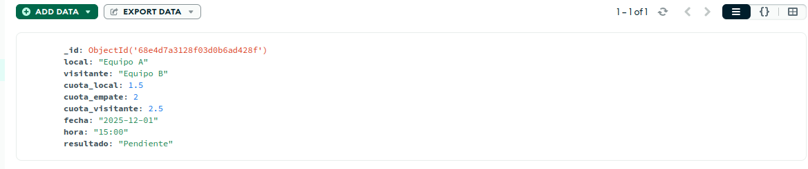
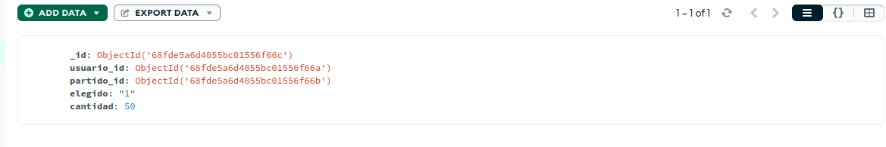

# Implementación

En este archivo se va a explicar todo lo relacionado con la implementación realizada en esta práctica.

## Base de datos
Para la base de datos he elegido MongoDB ya que es la que más he utilizado en la carrera, además de que es muy sencilla de utilizar y conectar mediante código.

Dentro de mi base de datos he creado 4 colecciones: usuarios, administradores, apuestas y partidos. Vamos a verlos uno a uno.

### Usuarios
Para los usuarios se almacenan los siguientes valores:

Su usuario, contraseña y saldo, así como un array con sus apuestas que inicialmente está vacío.

### Administradores
Para los administradores se almacenan:

Su usuario, contraseña y su rol (puede ser admin o moderador)

### Partidos
Para los partidos se almacenan:

Se guarda el nombre del equipo local y visitante, las cuotas para los 3 posibles resultados (local, empate o visitante), la fecha y hora, y el resultado el cual se inicializa a "Pendiente" por defecto.

### Apuestas
Para las apuestas se guardan:

Se almacena el usuario que ha hecho la apuesta junto con el partido apostado, la opción que se elige (1, X, 2) y la cantidad apostada.

## Funciones
El código se puede encontrar [aquí](https://github.com/benipr14/CC_Benigno_Parra/blob/main/Hitos/Hito2/funciones.py)

En resumen, se han creado las operaciones CRUD para las colecciones pero con matices, por ejemplo, no tiene sentido el crear_apuesta, sino el hacer_apuesta, ya que se requiere de un id_usuario y un id_partido para almacenar. Se han programado todas las casuísticas posibles para que no ocurran cosas que deberian suceder. Además, se han añadido algunas otras funciones como: sacar_saldo_usuario, cambiar_cuota_partido, cancelar_apuesta y demás que se pueden consultar.

## Tests
El código se puede encontrar [aquí](https://github.com/benipr14/CC_Benigno_Parra/blob/main/tests/test_funciones.py)

Se hace uso de los elementos explicados en los otros apartados y se comprueban las funciones una a una. Importante decir que se ha comprobado que cada función haga lo que se espera que haga y también lo que no se espera, es decir, que dé el error adecuado al intentar hacer algo ilegal, por ejemplo que el usuario intente cancelar una apuesta de un partido que ya se ha jugado.