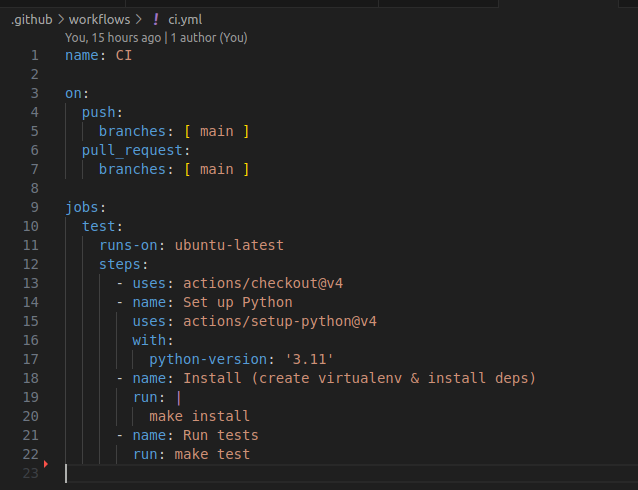

# Integración continua
El sistema de integración continua elegido es Github Actions, ya que es gratuito para repositorios públicos y está directamente integrado con Github, por lo que se activa automáticamente al hacer push. Además es sencillo de configurar y muy flexible por lo que me viene muy bien al no haber utilizado nunca un sistema de integración. Por último, permite ejecutar los mismos comandos (make install y make tests) en un runner limpio.

Su configuración es la siguiente:

Se activa cada vez que se hace un push o pull request al repositorio y se selecciona la última versión de ubuntu mediante ubuntu-latest. Después con checkout clona el repositorio en el workspace del runner para que los siguientes pasos puedan acceder al código. Luego, se elige la versión de python, en este caso 3.11. Por último, ejecuta los archivos mediante make, ya que así se mantiene la lógica de preparación de entorno en un único lugar y si en un futuro se cambian dependencias solo se tendría que actualizar el makefile.

Finalmente, se ha comprobado que funcionase al subir los archivos al repositorio:

Como se puede apreciar, aparece 1/1 y si se clica aparecerá el mensaje 'All checks have passed'.