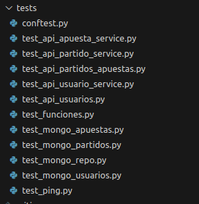

# Correcta ejecucución de los tests
Todos los tests están definidos a los siguientes archivos:

En el conftest.py se definen fixtures de pytest que luego se usan en los demás tests.

Para ejecutar los tests basta con escribir:
* make install
* make test (para los tests del Hito2)
* make test-integration (para los tests de la API y pruebas que usan Mongo/mongomock)
* make test-all (para ejecutar todos los tests)

Un ejemplo de la salida correcta es:

