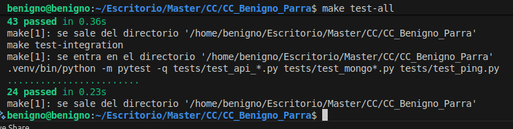

# Correcta ejecucución de los tests
Para ejecutar los tests basta con escribir:
make install
make test (para los tests del Hito2)
make test-integration (para los tests de la API)
make test-all (para ejecutar todos los tests)

Un ejemplo de la salida correcta es:
