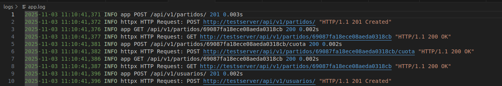

# Uso de logs
La aplicación registra la actividad HTTP y dispone de rotación de logs en fichero. El objetivo es trazar peticiones y errores. Se usa la biblioteca estándar de Python (logging) por su fiabilidad y portabilidad; el servidor y framework de la API es FastAPI (uvicorn en desarrollo).

Qué se registra:

* Datos de cada petición HTTP (middleware):
    Método HTTP, ruta, código de respuesta y duración (segundos).
    Errores no capturados con stacktrace.
* Logs de aplicación:
    Eventos de negocio importantes (crear usuario, hacer apuesta, terminar partido) con contexto: ids de usuario/partido/apuesta, montos y resultado.
* Sistema y acceso:
    Mensajes de inicio del servicio (uvicorn), warnings y excepciones.

Herramientas y configuración usada:

* Biblioteca: Python stdlib logging.
    * Justificación: ampliamente soportada, sin dependencias externas, configurable con múltiples handlers (console, fichero, rotación) y fácil de integrar con sistemas de recolección centralizada (Filebeat, Fluentd).
* Middleware de petición (FastAPI):
    * Implementado en main.py como @app.middleware("http") — registra método, ruta, status y latencia. FastAPI facilita la inserción de middleware y su integración es directa.
    * Justificación: FastAPI permite hooks HTTP simples y eficientes; colocarlo en middleware asegura que todas las rutas sean trazadas uniformemente.
* Rotación de ficheros:
    * Handler: RotatingFileHandler (size-based).
    * Parámetros por defecto: maxBytes=10*1024*1024 (~10 MB), backupCount=5.
      Archivo objetivo: app.log.
    * Justificación: rotación por tamaño es simple y evita que un fichero de log crezca indefinidamente; los valores por defecto (10MB, 5 backups)      equilibran retención y uso de disco para una app de este estilo.
* Formato:
    "%(asctime)s %(levelname)s %(name)s %(message)s" (timestamp, nivel, logger, mensaje).

En ejemplo de los logs de salida:

